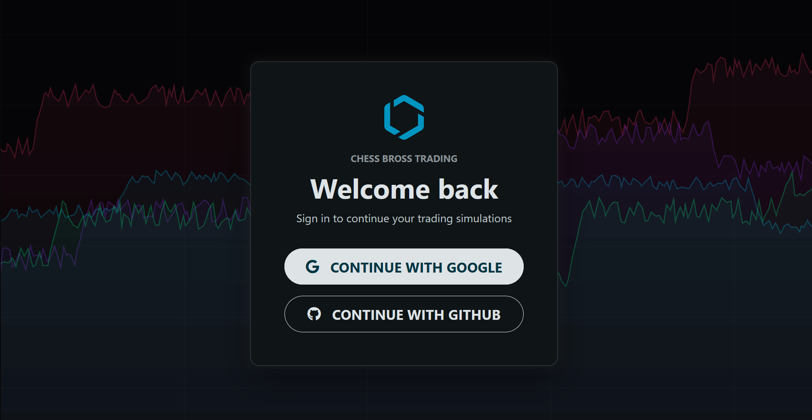
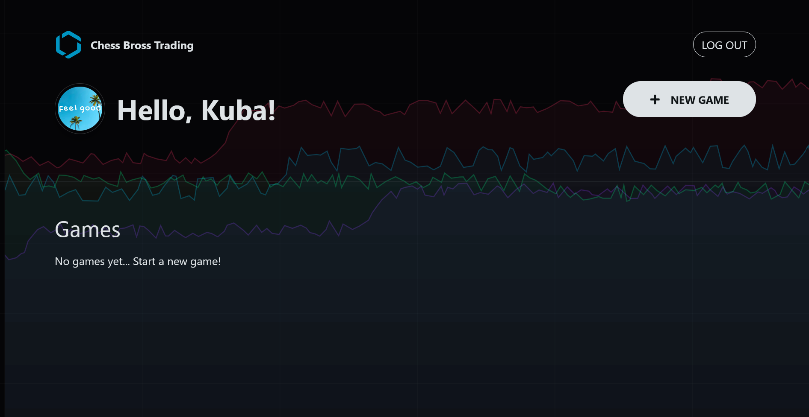
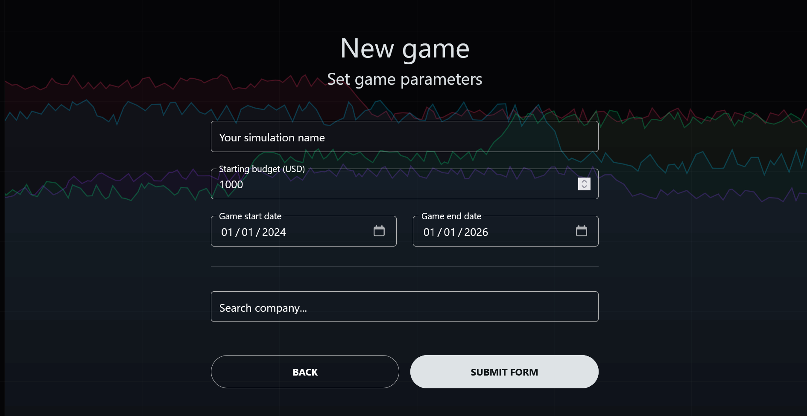
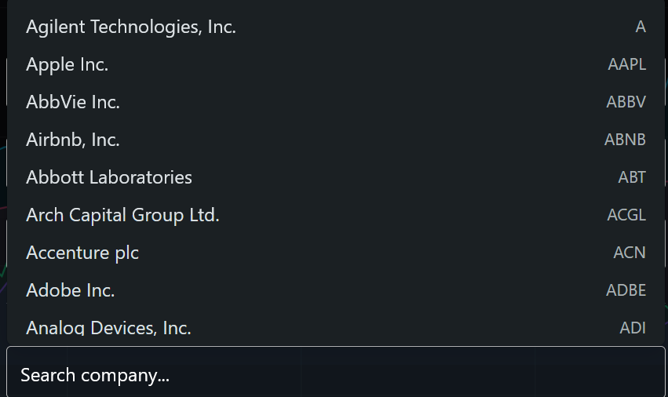
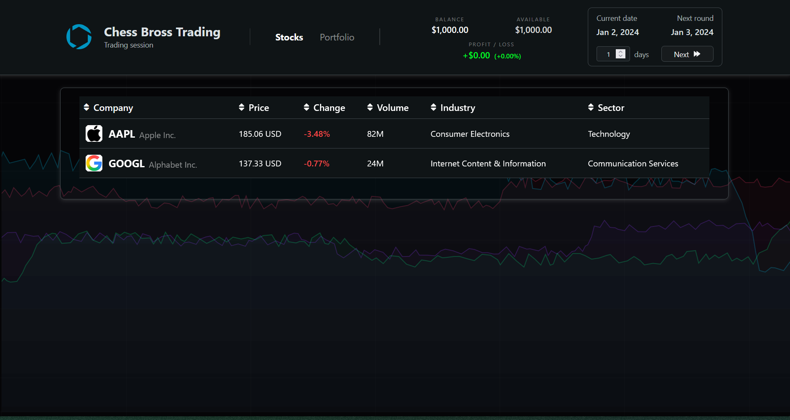
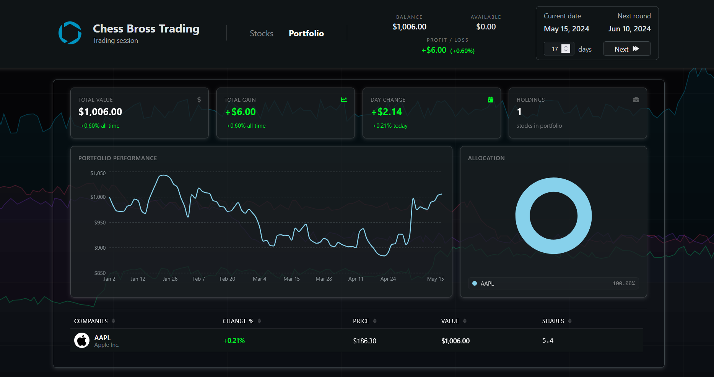
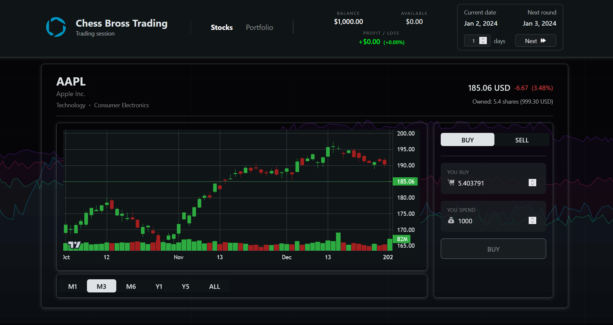
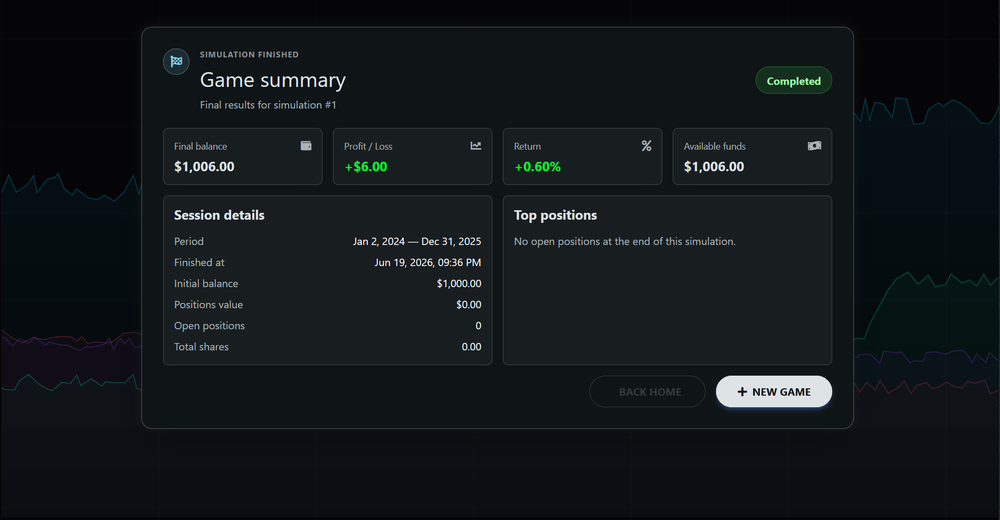

# ChessBrosTrading 

ChessBrosTrading is an educational web application that allows users to learn investing by creating stock market simulations based on historical market data from yahoo finance and S&P 500.

Users can create virtual portfolios, test investment strategies and analyze their performance without risking real money.

### Table of contents

- [How to use](#how-to-use)
- [Specification](#specification)
- [Project structure](#project-structure)
- [Building and running](#building-and-running)
- [Troubleshooting](#troubleshooting)

## How to use

#### 1) After launching the application, log in using your Google or GitHub account.



#### 2) Choose or create new simulation



#### 3) Create a simulation


And choose companies to take part in the simulation:


#### 4) Browse companies



#### 5) View Portfolio



#### 6) Invest!



#### 7) Summary



## Specification

### Backend

- FastAPI
- SQLAlchemy
- PostgreSQL
- Alembic
- Pydantic
- PyJWT
- yfinance

### Frontend

- React + TypeScript
- TanStack Query
- TradingView Lightweight Charts
- Recharts
- Tailwind CSS
- MDBootstrap

### DevOps

- Docker
- Docker Compose

## Building and running

### Clone repository

```bash
git clone https://github.com/24bartixx/web_clases.git
cd web_clases
```

### Configure environment variables

Backend:

```bash
cp backend/.env.example backend/.env
```

Frontend:

```bash
cp frontend/.env.example frontend/.env
```

Fill all required variables before running the application.

### Run application

```bash
docker-compose up --build -d
```

Stop containers:

```bash
docker-compose stop
```

Remove containers and volumes:

```bash
docker-compose down -v
```

## Available services

| Service     | URL                         |
| ----------- | --------------------------- |
| Frontend    | http://localhost:3000       |
| Backend API | http://localhost:8000       |
| Swagger UI  | http://localhost:8000/docs  |
| ReDoc       | http://localhost:8000/redoc |
| PostgreSQL  | localhost:5432              |

## Troubleshooting

In case of any problems feel free to share in the issues tab, thanks!
